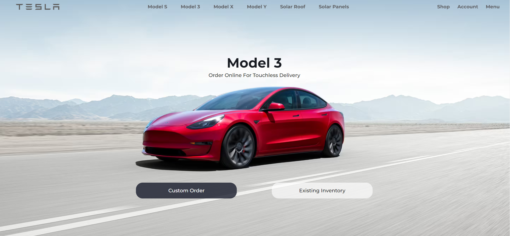

# Tesla Website Clone

This project is a clone of the Tesla website, showcasing the design and layout of the original Tesla website. It serves as a demonstration of front-end development skills, including HTML, CSS, and JavaScript.

## Features

- Responsive design: The clone website is designed to be fully responsive, adapting to different screen sizes and devices.
- Interactive components: The clone includes interactive elements, such as navigation menus, car slider, and contact form.
- Smooth scrolling: The website incorporates smooth scrolling functionality for seamless navigation.
- Modern design: The clone closely follows the modern design aesthetics of the original Tesla website.

## Technologies Used

- HTML5: The structure of the website is built using semantic HTML5 markup.
- CSS: Styling is implemented with CSS3, including custom styles and layout.
- JavaScript: JavaScript is used to add interactivity and dynamic behavior to the website.
- Bootstrap: The Bootstrap framework is utilized for responsive grid layout and some pre-styled components.
- FontAwesome: FontAwesome icons are used for certain graphical elements.

## Acknowledgements

- This project is inspired by the original design of the Tesla website (https://www.tesla.com/).
- Thanks to the Bootstrap and FontAwesome communities for their open-source contributions.

